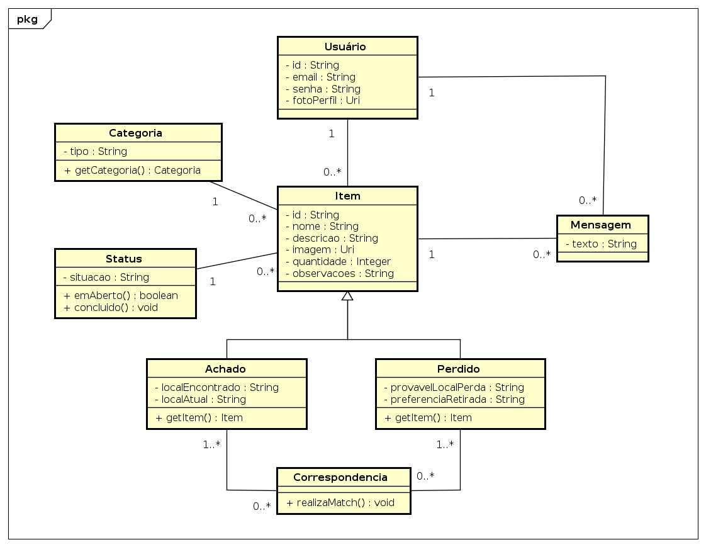
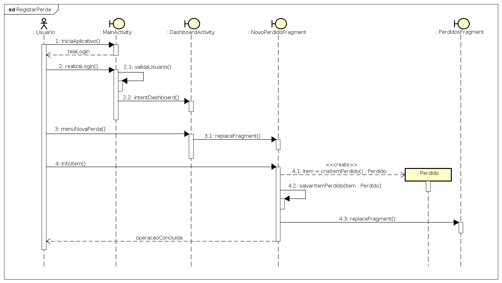
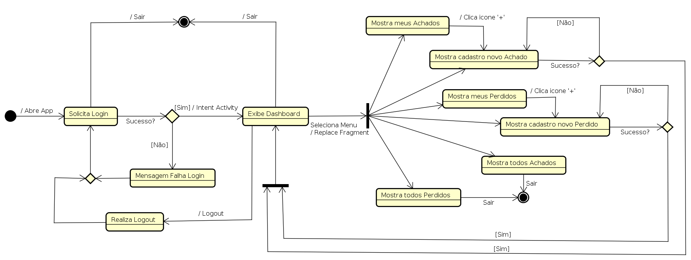
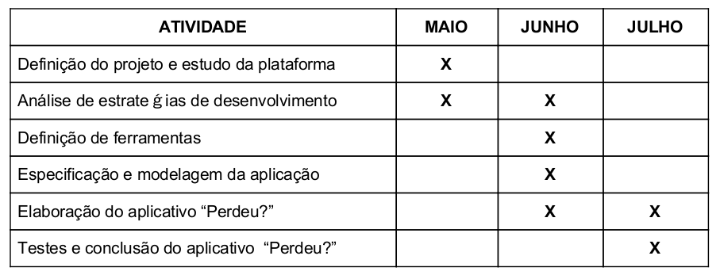

# app-perdeu

Este aplicativo foi desenvolvido na disciplina ELC1001 - Sistemas de Computação Móvel. 

## Sumário

- [Objetivos](#objetivos)
- [Justificativa](#justificativa)
- [Requisitos](#requisitos)
- [Modelagem](#modelagem)
	- [Diagramas de Classes](#classes)
	- [Diagrama de Sequência](#sequencia)
	- [Diagrama de Navegação](#navegacao)
- [Cronograma](#cronograma)

## Objetivos

O objetivo deste trabalho é criar um aplicativo de ​ achados e perdidos para a plataforma Android. Neste contexto, surge o aplicativo <b>"​Perdeu?​"</b>, que se propõem a centralizar os anúncios de itens perdidos ou encontrados na Universidade Federal de Santa Maria (UFSM), simplificando a comunicação e a coordenação das partes envolvidas, seja anunciando perdas ou deixando claro onde o pertence está sendo guardado, de modo que o seu dono possa vir apanhá-lo sem maiores dificuldade.

Ao realizar o login ​, o usuário poderá visualizar os últimos relatos realizados no aplicativo, seja de itens perdidos ou de itens encontrados. De mesmo modo, o usuário poderá comunicar, mediante preenchimento adequado das informações solicitadas, a perda de um item pessoal ou alertar o encontro de algum pertence dentro do Campus da UFSM.

## Justificativa

Atualmente, existe uma grande dificuldade em encontrar objetos pessoais perdidos dentro da UFSM. Quando algum membro da comunidade acadêmica perde algum pertence, este deve procurá-lo em lugares recorrentes (bibliotecas, coordenações, restaurantes universitários, redes sociais, etc.) na esperança de encontrar sua posse desaparecida. De mesmo modo, quando algum item é encontrado, não há um meio realmente efetivo para buscar e alertar seu portador.

Com o uso do aplicativo, será possibilitado uma visualização rápida e interativa dos mais diversos relatos objetos achados ou perdidos dentro da universidade. Deste modo, espera-se que todo o processo de comunicação entre as partes envolvidas seja simplificado, favorecendo a recuperação de itens perdidos. Desta forma, a justificativa deste projeto está relacionada, mas não limitada, aos seguintes pontos:

- Atuar como ​ plataforma unificada ​ de relatos relacionados a achados e perdidos na UFSM;
- Facilitar a devolução de itens encontrados e aumentar as chances de encontrar algum bem perdido dentro da UFSM;
- Coordenar o processo de devolução, de modo a evitar desencontros, melhorando a comunicação entre as partes envolvidas;
- Estimular usuários a devolverem e a procurarem objetos perdidos, tendo em vista a simplicidade em fazer tal relato.

## Requisitos

O aplicativo “Perdeu?” pode ser acessado por diferentes membros da comunidade acadêmica. Este acesso ocorrerá através de um aparelho Android com conexão à internet, inicialmente o número máximo de requisições diárias realizadas no aplicativo será limitado pela capacidade e escalabilidade das plataformas utilizadas (e.g. Versão gratuita do ​ Firebase). A aplicação utiliza softwares gratuitos, dispensando a aquisição de licenças.

Por motivos de controle, o uso das funcionalidades do sistema é limitado a usuários devidamente validados (e.g. a partir de uma conta no Facebook). Outros requisitos funcionais, representando as interações do usuário com o sistema, incluem: inclusão de registros de achados e perdidos; consulta e visualização dos últimos achados e perdidos registrados no aplicativo; verificar a situação de um achado ou de um perdido; dentre outros. ​ 

Já os requisitos não funcionais, que são realizados pelo próprio sistema, incluem: base de dados protegida, podendo ser acessada apenas por usuários autorizados; uso de ​ design ​ responsivo nas interfaces; novos registro de achados e perdidos devem ser devidamente cadastrados; a partir de dois dias (48 horas) os registros devem ser considerados obsoletos; dentre outros.

Para o desenvolvimento da aplicação será utilizado o Android Studio, o ambiente de desenvolvimento integrado (IDE) oficial para o desenvolvimento de aplicativos Android. Além do editor de código e de ferramentas de desenvolvedor avançado, o Android Studio oferece diversos recursos para aumentar a produtividade na criação de aplicativos Android, como por exemplo: um sistema de compilação flexível baseado no Gradle; um emulador integrado da plataforma Android; o ​ Instant Run, capaz de aplicar alterações a aplicativos em execução sem precisar (re)compilar um novo ​Android Package ​(APK); dentre outros.

## Modelagem

Seguindo o contexto do aplicativo “Perdeu?” e fazendo uso da ferramenta de modelagem Astah, que suporta UML, foram criados os seguintes diagramas:

### Diagramas de Classes

Uma previsão do diagrama de classes referente a camada modelo da aplicação pode ser observada na figura abaixo. Por questões de isolamento da camada de negócios, não estão ilustradas neste diagrama classes referente a interfaces (Atividades) ou Adaptadores.

	

- Usuário: Ator primário do sistema, entre suas ações realiza o cadastro de Achados e Perdidos;
- Item: Superclasse que representa um bem qualquer;
- Status: Informa a situação atual de um item perdido ou encontrado (e.g. devolvido, procurando dono, paradeiro desconhecido, dentre outros);
- Categoria: Informa o tipo de um item perdido ou Encontrado (e.g. vestimenta, dinheiro, guarda-chuva, eletrônico, dentre outros);
- Achado: Subclasse que define um item como um bem Achado;
- Perdido: Subclasse que define um item como um bem Perdido;
- Mensagem*: Classe auxiliar que prepara o sistema para uma provável troca de mensagens;
- Correspondência*: Classe auxiliar para possibilitar futura resolução de situações de interesse entre Usuários distintos (<em>matching</em>).

\* Algumas das classes auxiliares podem não estar aplicadas ao contexto da versão inicial do aplicativo.

### Diagrama de Sequência

Um exemplo de interação com o sistema é ilustrado abaixo, note que a ação “Registrar Perda” é análoga a ação “Registar Achado”.

	

### Diagrama de Navegação

O diagrama abaixo ilustra o processo básico de navegação entre as diferentes Activities ​e Fragments.

	

## Cronograma

O cronograma de implementação segue o seguinte planejamento:

	

